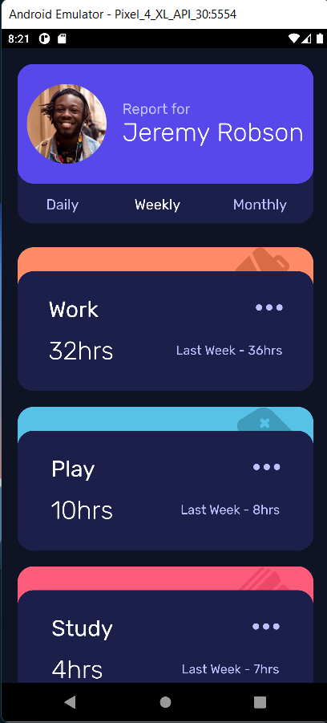

# time_tracking_dashboard_ui

This is a solution to the [Time tracking dashboard challenge on Frontend Mentor](https://www.frontendmentor.io/challenges/time-tracking-dashboard-UIQ7167Jw).

## Table of contents

- [The challenge](#the-challenge)
- [Screenshot](#screenshot)

### The challenge

Users should be able to:

- See hover states for all interactive elements on the page
- Switch between viewing Daily, Weekly, and Monthly stats
- to create UI like this
   

### Screenshot of my App

